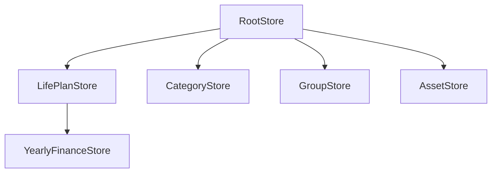
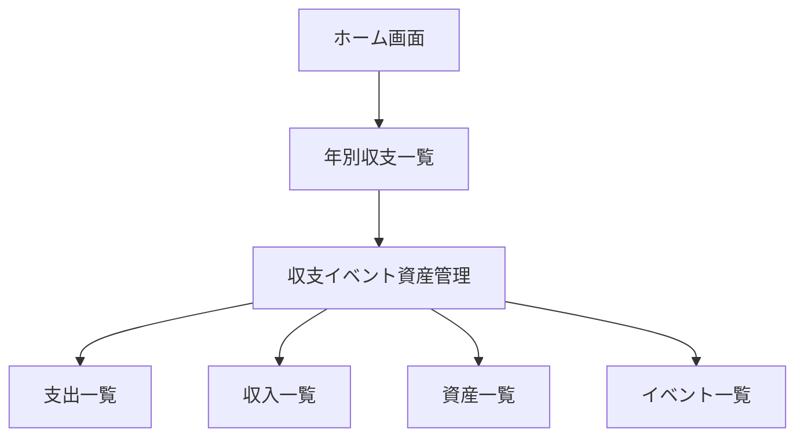

# シャークライフプランマネージャー アーキテクチャ設計書

## 1. アプリケーション全体構造

### 1.1 ディレクトリ構造
```
src/
├── components/        # 共通コンポーネント
│   ├── common/       # 汎用的なUIコンポーネント
│   ├── forms/        # フォームコンポーネント
│   ├── modals/       # モーダルコンポーネント
│   ├── charts/       # グラフコンポーネント
│   └── layout/       # レイアウトコンポーネント
│
├── screens/          # 画面コンポーネント
│   ├── home/        # ホーム画面関連
│   ├── yearly/      # 年別収支一覧関連
│   └── detail/      # 収支イベント資産管理関連
│
├── stores/          # MobXストア
│   ├── RootStore.js      # ルートストア
│   ├── LifePlanStore.js  # ライフプラン管理
│   ├── CategoryStore.js   # カテゴリ管理
│   ├── GroupStore.js      # グループ管理
│   └── AssetStore.js      # 資産管理
│
├── models/          # データモデル定義
│   ├── LifePlan.js
│   ├── Category.js
│   ├── Group.js
│   └── Asset.js
│
├── services/        # ビジネスロジック
│   ├── calculators/  # 計算ロジック
│   ├── exporters/    # データエクスポート
│   └── importers/    # データインポート
│
├── utils/           # ユーティリティ関数
│   ├── format.js    # フォーマット関数
│   ├── validate.js  # バリデーション関数
│   └── storage.js   # ストレージ操作
│
├── constants/       # 定数定義
│   ├── colors.js
│   ├── config.js
│   └── types.js
│
└── navigation/      # ナビゲーション設定
    └── AppNavigator.js
```

### 1.2 主要技術スタック
- **フレームワーク**: Expo (React Native)
- **状態管理**: MobX
- **永続化**: AsyncStorage
- **UI**: React Native Paper
- **グラフ**: react-native-charts-wrapper
- **データ処理**: 
  - pako (gzip圧縮)
  - base-64 (エンコード/デコード)

## 2. データフローと状態管理

### 2.1 MobXストア構成


### 2.2 データフロー
1. **ユーザーアクション**
   - UIイベント発生
   - バリデーション
   - ストアのアクション呼び出し

2. **ストア処理**
   - データ更新
   - 計算処理
   - 永続化

3. **UI更新**
   - 自動的なリアクティブ更新
   - エラー表示
   - ローディング状態管理

### 2.3 永続化戦略
- AsyncStorageを使用したデータ保存
- gzip圧縮とbase64エンコードによるエクスポート/インポート
- 自動保存とバックアップ機能

## 3. 画面構成とコンポーネント設計

### 3.1 ナビゲーション構造


### 3.2 共通コンポーネント
- **CustomModal**: モーダルの基本テンプレート
- **CategoryPieChart**: カテゴリ別円グラフ
- **CustomTable**: テーブル表示用コンポーネント
- **FormInput**: 入力フォームコンポーネント
- **IconButton**: アイコン付きボタン

### 3.3 レスポンシブデザイン戦略
- Flexboxベースのレイアウト
- デバイスサイズに応じた動的スタイリング
- 画面サイズ別のレイアウト最適化

## 4. ユーティリティ関数とヘルパー

### 4.1 計算ユーティリティ
- 税金計算
- 資産運用シミュレーション
- インフレーション調整

### 4.2 フォーマッター
- 金額表示
- 日付表示
- パーセンテージ表示

### 4.3 バリデーター
- 入力値検証
- ビジネスルール検証
- データ整合性チェック

## 5. テスト戦略

### 5.1 テストレベル
- **ユニットテスト**: 計算ロジック、ユーティリティ関数
- **インテグレーションテスト**: ストア間の連携
- **UIテスト**: コンポーネントの振る舞い
- **E2Eテスト**: 主要なユーザーフロー

### 5.2 テスト自動化
- Jest + React Native Testing Library
- Detox for E2Eテスト
- CI/CDパイプラインとの統合

## 6. エラーハンドリング

### 6.1 エラー種別
- **バリデーションエラー**: ユーザー入力関連
- **計算エラー**: 数値計算関連
- **ストレージエラー**: データ永続化関連
- **ネットワークエラー**: インポート/エクスポート関連

### 6.2 エラー表示戦略
- トースト通知
- モーダル表示
- インライン表示
- エラーバウンダリ

## 7. パフォーマンス最適化

### 7.1 最適化戦略
- メモ化（useMemo, useCallback）
- 仮想化リスト（FlatList）
- 遅延ローディング
- 計算のキャッシュ化

### 7.2 監視指標
- 画面描画時間
- メモリ使用量
- ストレージ容量
- 操作応答時間

## 8. セキュリティ考慮事項

### 8.1 データ保護
- エクスポートデータの暗号化
- センシティブデータの保護
- アプリロック機能

### 8.2 入力検証
- サニタイズ処理
- 型チェック
- 範囲チェック

## 9. 将来の拡張性

### 9.1 拡張ポイント
- クラウド同期機能
- 複数デバイス間同期
- データ分析機能
- レポート生成機能

### 9.2 コード設計原則
- SOLID原則の遵守
- 疎結合な設計
- プラグイン可能なアーキテクチャ
- 設定による機能制御